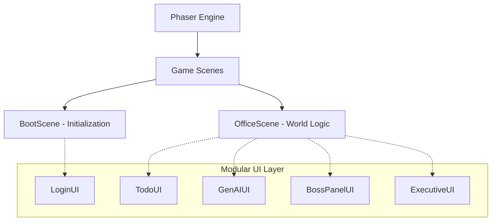

<div align="center">


# 🏢 OfficeVerse

### **The Ultimate Multiplayer OfficeVerse**

*Work, Collaborate, and Have Fun in Your Virtual Office!*

[](./LICENSE)


[Quick Start](#-quick-start) • [Features](#-epic-features) • [Controls](#-master-the-controls) • [Architecture](#-smart-architecture)

</div>

---

## 🎮 What is OfficeVerse?

**OfficeVerse** isn't just another productivity tool—it's a living, breathing digital ecosystem. It transforms the mundane remote work experience into a vibrant, interactive pixel world.

> [!IMPORTANT]
> **Why OfficeVerse?** Because Zoom fatigue is real. OfficeVerse brings back the "water cooler" moments, the desk-side chats, and the feeling of belonging to a team, all within a beautiful, gamified environment.

### ✨ Experience the Magic

- 🤝 **Seamless Collaboration** — Real-time presence without the camera pressure.
- 🤖 **AI-Powered Sidekick** — Your personal assistant, powered by Mistral AI.
- 🎨 **Your Persona** — Multiple characters and customizable skins to express yourself.
- 🎮 **Work-Life Balance** — Integrated gaming zones for those much-needed breaks.

---

## 🚀 Epic Features

| Feature | The Vibe |
|:---|:---|
| 🗺️ **Living Office Map** | From the **Zen Garden** to the **Boss's Executive Suite**, every corner has a purpose. |
| 👥 **Hyper-Sync Multiplayer** | Smooth movement and real-time synchronization that feels like magic. |
| 💬 **Rich Communication** | Global chat, private whispers, and **P2P Voice Calls** for true connection. |
| 🤖 **AI Assistant** | A context-aware Mistral AI companion ready to brainstsom with you. |
| 📋 **Smart Desks** | Personal task management that stays where you left it. |
| 📊 **Vitals Engine** | Manage your **Energy** ⚡ and **Stress** 😫 to stay at peak performance. |

---

## 🏗️ Smart Architecture

OfficeVerse uses a cutting-edge **Modular UI-Scene Separation** pattern, ensuring the game stays fast and the code stays clean.



---

## 🛠️ Tech Stack

<table align="center">
  <tr>
    <td align="center" width="33%">
      <b>Frontend</b><br>
      Phaser 3.80<br>
      Vite<br>
      WebRTC (Voice)<br>
      Tailored CSS
    </td>
    <td align="center" width="33%">
      <b>Backend</b><br>
      Spring Boot 4.0<br>
      WebSockets<br>
      Mistral AI<br>
      H2 Database
    </td>
    <td align="center" width="33%">
      <b>Security</b><br>
      CORS Guard<br>
      Input Sanitization<br>
      Server-side Keys
    </td>
  </tr>
</table>

---

## 📦 Quick Start

### 1️⃣ Fire up the Server

```bash
cd officeVerse_server
gradle bootRun
```

### 2️⃣ Launch the Client

```bash
cd officeVerse_client
npm install
npm run dev
```

### 3️⃣ Enter the OfficeVerse

Open `http://localhost:5173` and start your new work life! 🚀

---

## 🎮 Master the Controls

> [!TIP]
> Use the **Zen Room** (🧘) when your stress gets high to turn your avatar blue and find your inner peace!

| Command | Action |
|:---|:---|
| `Arrows / WASD` | Navigate the OfficeVerse |
| `F` | Interact with the World |
| `E` | Chat with Colleagues |
| `Enter` | Submit / Send |

---

## Folder Structure & Customization

See our [detailed architecture guide](officeVerse_client/README.md) to learn how to add your own zones, characters, or AI behaviors.

---

## 🤝 Contributing

We welcome contributions! Please follow these steps:

1.  Fork the repository.
2.  Create a feature branch (`git checkout -b feature/AmazingFeature`).
3.  Commit your changes (`git commit -m 'Add some AmazingFeature'`).
4.  Push to the branch (`git push origin feature/AmazingFeature`).
5.  Open a Pull Request.

## 📄 License

Distributed under the MIT License. See `LICENSE` for more information.

---

<div align="center">

### **Ready to redefine how you work?**

[Documentation](./officeVerse_client/README.md) • [Issues](https://github.com/zoo-hair/ov/issues) • [Vision](#-vision)

**Copyright © 2026 OfficeVerse Team**
*Made with ❤️ and pixel dust.*

</div>
